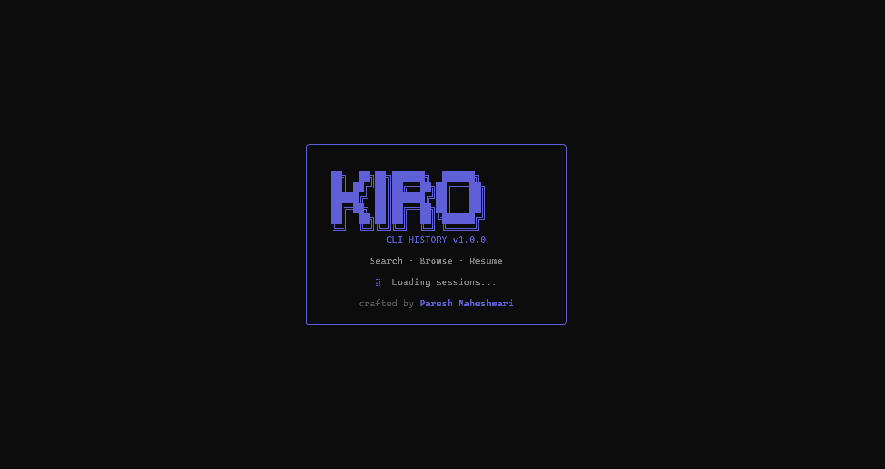
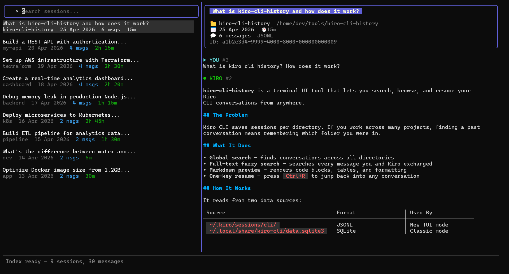
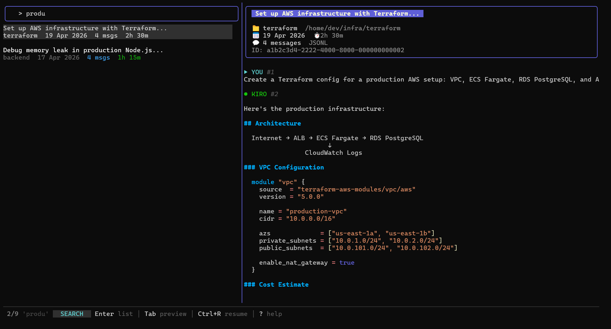
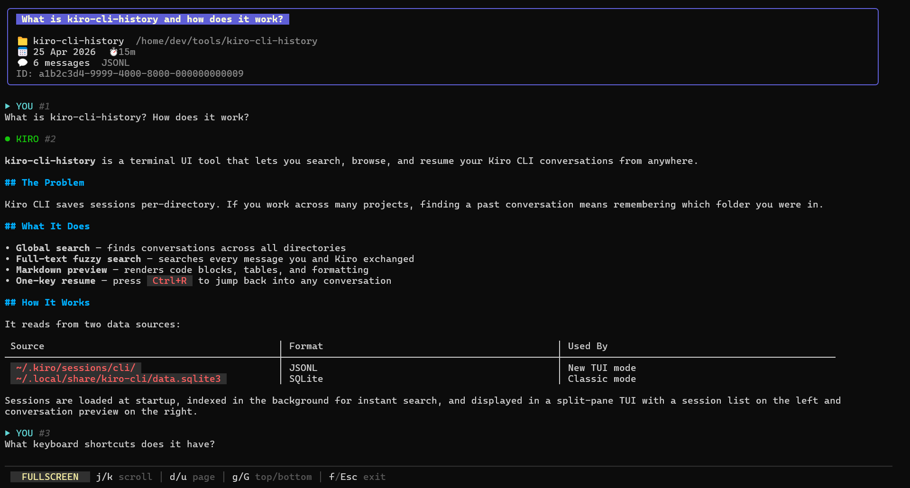
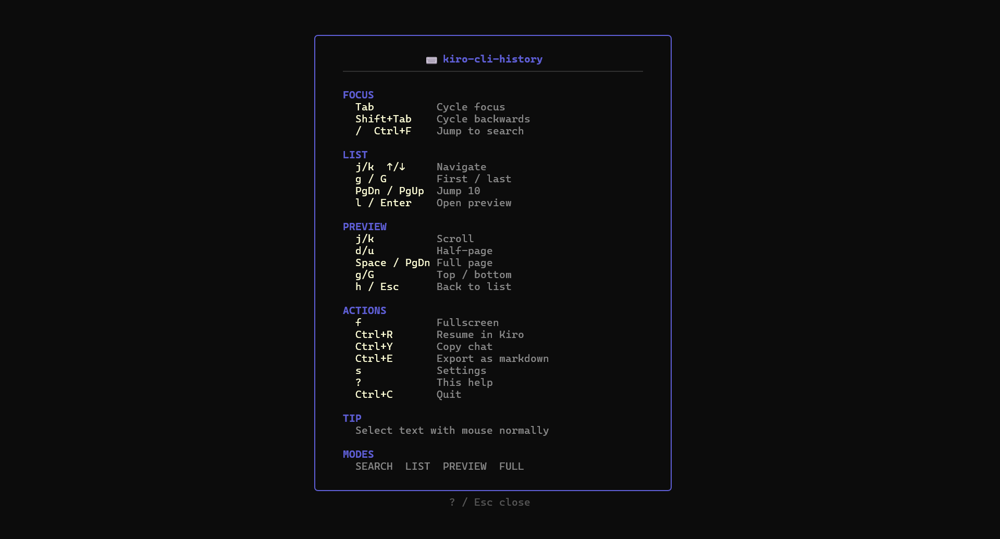
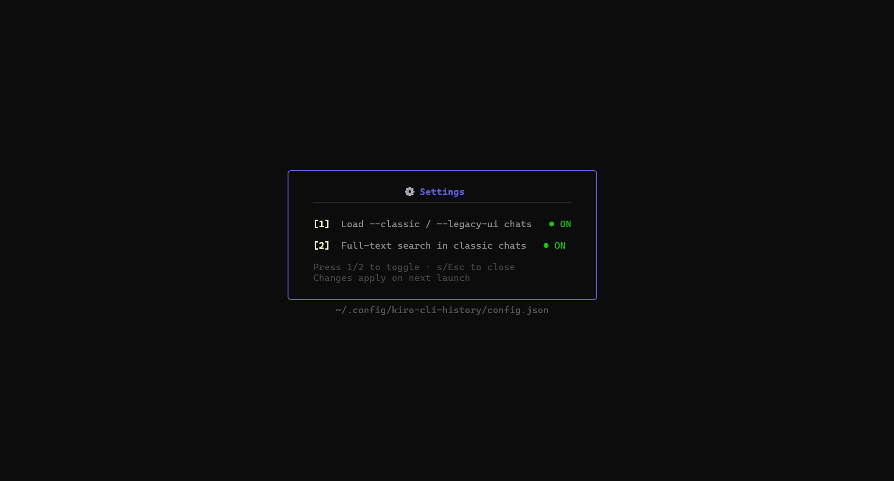

# kiro-cli-history

[](https://github.com/Paresh-Maheshwari/kiro-cli-history/actions/workflows/ci.yml)
[](https://github.com/Paresh-Maheshwari/kiro-cli-history/actions/workflows/release.yml)
[](https://github.com/Paresh-Maheshwari/kiro-cli-history/releases/latest)
[](https://go.dev)
[](LICENSE)

A fast terminal UI for fuzzy-searching, browsing, and resuming [Kiro CLI](https://kiro.dev/docs/cli/) conversations.

> **Read-only** — never writes to or modifies your Kiro CLI session data.

## The problem

Kiro CLI saves sessions per-directory. If you work across many projects, finding a past conversation means remembering which folder you were in. `kiro-cli-history` gives you **global fuzzy search across all sessions** — regardless of directory.

## Screenshots

### Splash screen


### Main view — session list with markdown preview


### Fuzzy search — filter sessions in real-time


### Fullscreen — expanded preview for wide content


### Help — all keyboard shortcuts


### Settings — configure data sources


## Features

- **Global search** — find conversations across all directories
- **Full-text fuzzy search** — searches every message, not just titles
- **Markdown preview** — rendered markdown, code blocks, tables
- **Fullscreen mode** — press `f` for wide content like tables
- **One-key resume** — `Ctrl+R` to continue a conversation in Kiro CLI
- **Copy to clipboard** — `Ctrl+Y` to copy an entire conversation
- **Export as markdown** — `Ctrl+E` to save conversation as `.md` file
- **Text selection** — select and copy text directly from the preview
- **All session formats** — reads JSONL (new TUI mode) and SQLite (--classic / --legacy-ui)
- **Fast** — 200ms startup, instant search, background indexing
- **Configurable** — toggle SQLite loading, full-text indexing via settings (`s`)

## Session data locations

Reads from (all read-only):
- `~/.kiro/sessions/cli/` — JSONL sessions (new TUI mode)
- `~/.local/share/kiro-cli/data.sqlite3` — SQLite sessions (Linux, --classic / --legacy-ui)
- `~/Library/Application Support/kiro-cli/data.sqlite3` — SQLite sessions (macOS)

## Install

### One-liner (prebuilt binary, no Go needed)

```bash
curl -sL https://raw.githubusercontent.com/Paresh-Maheshwari/kiro-cli-history/main/get.sh | bash
```

Auto-detects your OS (Linux/macOS) and architecture (amd64/arm64), downloads the latest release binary to `~/.local/bin/`.

### From source (requires Go 1.21+)

```bash
git clone https://github.com/Paresh-Maheshwari/kiro-cli-history.git
cd kiro-cli-history
bash install.sh
```

## Usage

```bash
kiro-cli-history
```

Run from anywhere. It searches globally.

### Keyboard shortcuts

| Key | Action |
|-----|--------|
| `/` or `Ctrl+F` | Focus search bar |
| `Tab` / `Shift+Tab` | Cycle focus: search → list → preview |
| `j` / `k` or `↑` / `↓` | Navigate list or scroll preview |
| `l` / `Enter` | Open preview pane |
| `h` / `Esc` | Back to list |
| `f` | Fullscreen preview |
| `d` / `u` | Half-page scroll in preview |
| `g` / `G` | Jump to top / bottom |
| `Ctrl+R` | Resume session in Kiro CLI |
| `Ctrl+Y` | Copy conversation to clipboard |
| `Ctrl+E` | Export conversation as markdown |
| `s` | Settings |
| `?` | Help overlay |
| `Ctrl+C` | Quit |

### Modes

The status bar shows the current mode:

- **SEARCH** — type to filter sessions by title, directory, or content
- **LIST** — browse and select sessions
- **PREVIEW** — read conversation with markdown rendering
- **FULLSCREEN** — expanded preview for wide content

### Settings

Press `s` to open settings. Config saved to `~/.config/kiro-cli-history/config.json`:

| Setting | Default | Description |
|---------|---------|-------------|
| Load classic mode chats | ON | Load SQLite sessions from --classic / --legacy-ui |
| Full-text search classic chats | OFF | Index classic chat content (slow on large DBs) |

### Searching

Type in the search bar to fuzzy-search across:
- Session titles
- Working directories
- Full conversation content (every message)

Search is case-insensitive. Multiple words are AND-matched (`deploy aws` finds sessions containing both words).

### Export

Press `Ctrl+E` to export the current conversation as a markdown file. Files are saved to `~/kiro-exports/` with a timestamped filename.

## How it works

Kiro CLI stores conversations in multiple formats:

| Format | Location | Used by |
|--------|----------|---------|
| JSONL | `~/.kiro/sessions/cli/*.json` + `*.jsonl` | New TUI mode (`kiro-cli`) |
| SQLite v2 | `data.sqlite3` → `conversations_v2` | `kiro-cli --classic` / `--legacy-ui` |
| SQLite v1 | `data.sqlite3` → `conversations` | Older classic versions |

`kiro-cli-history` reads all formats and presents them in a unified view.

## Platform

Linux and macOS. Uses `xclip`/`xsel`/`wl-copy` (Linux) or `pbcopy` (macOS) for clipboard.

## License

MIT — crafted by [Paresh Maheshwari](https://github.com/Paresh-Maheshwari)
